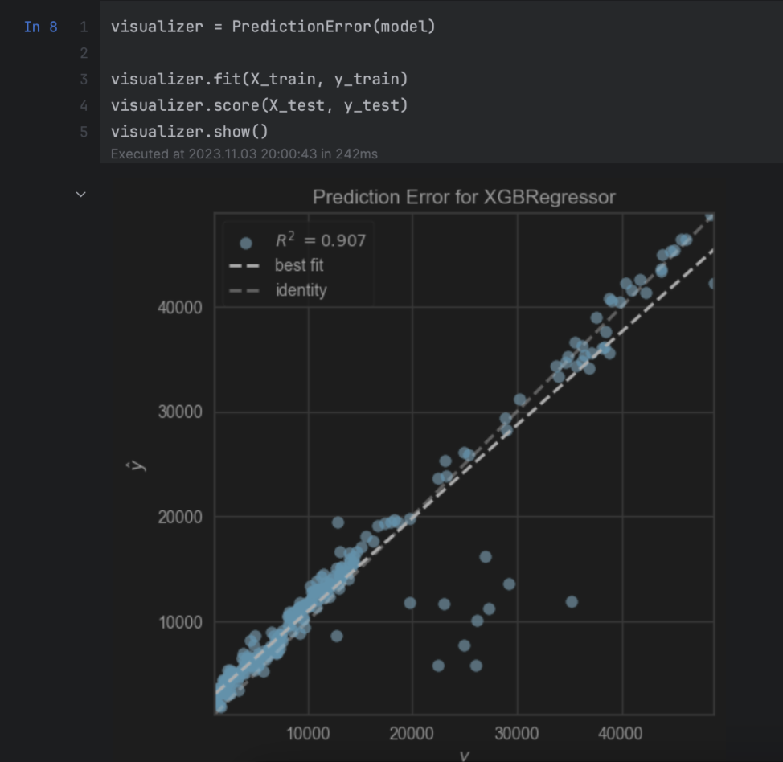

# Corrective and Adaptive maintenance on a Regression Model 

Author : Felix Zhao

This is a maintained version of previously built regression ML model by Brian Schmidt,
cloning it as is would not run and here are the maintenance steps I made to it to make it run.

Instructions after the marker "FZ_NOV2023: " are modifications from the original blog, but since modifications are already made,
readers can just execute the commands as is.


## Requirements

Python 3.9

## Installation

To clone the repository:

```bash
git clone https://github.com/felixzhaofelix/regression-model.git
```

To create and activate a virtual environment:

```bash
# go into the project directory
cd regression-model

make venv

source venv/bin/activate
```

Install the dependencies:

```bash
make dependencies
```
### FZ_NOV2023: The above command would have actually failed at first because of conflicts between dependencies, after some trial and error, I have determined that we need to change the content of requirements.in 
### from this:
```
featuretools==0.24.0
jupyter
kaggle
ml-base>=0.1.0
pandas
pandas_profiling
rest_model_service>=0.1.0
scikit-learn==0.24.2
tpot==0.11.7
yellowbrick==1.3

```
### to this

```
featuretools==0.24.0
scikit-learn>=1.3.2
tpot>=0.12.1
yellowbrick>=1.5
pydantic==1.10.13
fastapi==0.66.0
starlette==0.14.2
```
### FZ_NOV2023: and instead using this line in the Makefile:
```
pip install -r requirements.txt
```
### I used this one.
```
pip-compile requirements.in --upgrade
```
### Also there's no need to execute the below command either anymore, all dependencies have been considered.

```bash
make train-dependencies
```

## Running the Unit Tests
To run the unit test suite execute these commands:

```bash
# first install the test dependencies
make test-dependencies

# run the test suite
make test

# clean up the unit tests
make clean-test
```
### FZ_NOV2023: The above testing commands would not have worked due to incompatibility issues with, among others, Scikit-Learn, so a couple of changes were needed:

### first, there was an error with numpy in the transformer.py file, so I changed these lines:
```
import numpy as np
from numpy import bool_, inf, int, float
```

### to these:
```
import numpy as np 
from numpy import bool_, inf, int_, float_
```

### Two of the five tests still haven't passed, which brought me to the next step: 

### secondly, the model needed to be retrained from how it was a couple of years ago, so I retrained the model with these files:
```
regression-model/data_exploration.ipynb
regression-model/data_preparation.ipynb
regression-model/model_training.ipynb
regression-model/model_validation.ipynb
```

### The new model uses XGBRegressor from genetic programming with TPOT and has better fit:


### Then the tests have passed.


## Running the Service

To start the service locally, execute these commands:

```bash
uvicorn rest_model_service.main:app --reload
```


#### Present work is based on that of the original author Brian Schmidt [blog post](https://www.tekhnoal.com/regression-model.html).